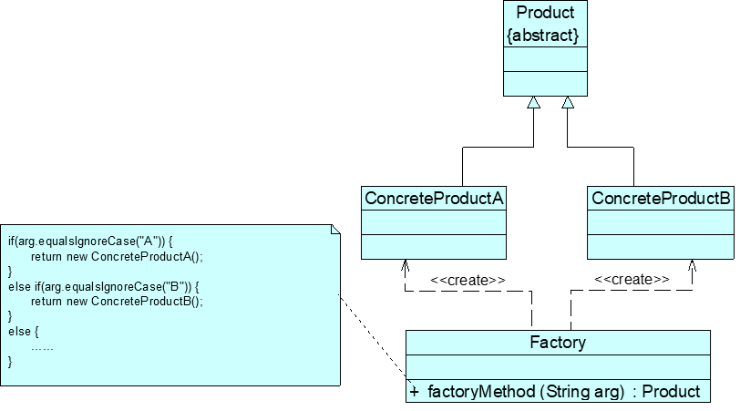

# 简单工厂模式

## 模式概述

定义:
定义一个工厂类,它可以根据参数的不同返回不同类的实例,被创建的实例通常具有共同的父类

实现流程:
1. 将需要创建的各种不同产品对象的相关代码封装到不同的类中,这些类成为具体产品类
2. 将他们公共的代码进行抽象和提取后封装在一个抽象产品类中,每一个具体产品类都是抽象产品类的子类
3. 提供一个工厂类用于创建各种产品
4. 在工厂类中中提供一个创建产品的工厂方法,该方法可以根据所传入的参数不同创建不同的具体产品对象
5. 客户端只需要调用工厂类的工厂方法并传入相应的参数,即可得到一个产品对象

## 模式结构与实现



* 工厂角色 Factory
* 抽象产品角色 Product
* 具体产品角色 ConcreteProduct
* 客户端

抽象产品类:
```java
public abstract class Product{
    //所有产品类的公共业务方法
    public void methodSame(){
        //公共方法的实现
    }
    //声明抽象业务方法
    public abstract void methodDiff();
}
```
具体产品类:
```java
public class ConcreteProduct extends Product{
    //实现业务方法
    public void methodDiff(){
        //业务方法的实现
    }
}
```
工厂类:
```java
public class Factory{
    //静态工厂方法
    public static Product getProduct(String arg){
        Product product = null;
        if(arg.equalsIgnoreCase("A")){
            product = new ConcreteProductA();
            //初始化设置 product
        }
        if(arg.equalsIgnoreCase("B")){
            product = new ConcreteProductB();
            //初始化设置 product
        }
        return product;
    }
}
```
客户端类:
```java
public class Client{
    public static void main(String args[]){
        Product product;
        product = Factory.getProduct("A");
        product.methodSame();
        product.methodDiff();
    }
}
```

## 模式应用实例

见DesignPattern项目文件-simpleFactoryPattern包

## 模式优/缺点与适用环境

优点:
1. 包含必要的判断逻辑,可以决定哪个时候创建哪一个产品类的实例,客户端可予以免除直接创建产品对象的职责,实现了对象创建与使用的分离
2. 客户端无需知道所创建的具体产品类的类名,只需要知道具体产品类所对应的参数即可,在一定程度上减少了使用者的记忆量
3. 通过引入配置文件,可以在不修改任何客户端代码的情况下更换和新增具体的产品类,一定程度上提高了产品灵活性

缺点:
1. 工厂类集中了所有产品的创建逻辑,职责过重,一旦不能正常工作,整个系统将会受到影响
2. 会增加系统中类的个数,增加了系统的复杂度和理解难度
3. 系统扩展困难,添加新产品就不得不修改工厂逻辑,在产品类型较多时可能造成工厂逻辑过于复杂,不利于系统扩展和维护
4. 简单工厂模式由于使用了静态工厂方法,造成了工厂角色无法形成基于继承的等级结构

适用环境:
1. 工厂类创建的对象比较少
2. 客户端只知道传入工厂的参数,不关心如何创建对象