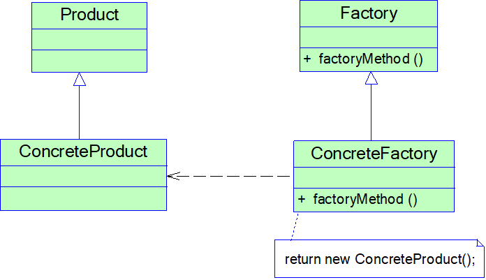

# 工厂方法模式

## 模式概述

定义:
定义一个用于创建对象的接口，但是让子类决定将哪一个类实例化。工厂方法模式让一个类的实例化延迟到其子类

## 结构与实现



* 抽象产品 Product
* 具体产品 ConcreteProduct
* 抽象工厂 Factory
* 具体工厂 ConcreteFactory

抽象工厂类(接口):
```java
public interface Factory{
    public Product factoryMethod();
}
```
具体工厂类:
```java
public class ConcreteFactory implements Factory{
    public Product factoryMethod(){
        return new ConcreteProduct();
    }
}
```
客户端类:
```java
public class Client{
    public static void main(String args[]){
        Factory factory;
        factory = new ConcreteFactory(); //可通过配置文件和反射机制实现
        Product product;
        product = factory.factoryMethod();
    }
}
```

## 模式应用实例

见DesignPattern项目文件-FactoryMethodPattern包

## 模式优/缺点与适用环境

优点:
* 工厂方法用来创建客户所需要的产品，同时还向客户隐藏了哪种具体产品类将被实例化这一细节
* 能够让工厂自主确定创建何种产品对象，而如何创建这个对象的细节则完全封装在具体工厂内部
* 在系统中加入新产品时，完全符合开闭原则

缺点:
* 系统中类的个数将成对增加，在一定程度上增加了系统的复杂度，会给系统带来一些额外的开销
* 增加了系统的抽象性和理解难度

适用环境:
* 客户端不知道它所需要的对象的类(客户端不需要知道具体产品类的类名，只需要知道所对应的工厂即可，具体产品对象由具体工厂类创建)
* 抽象工厂类通过其子类来指定创建哪个对象