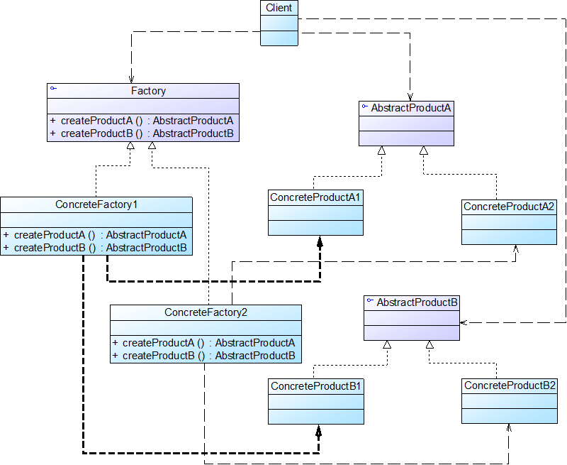

# 抽象工厂模式

## 模式概述

定义: 
提供一个创建一系列相关或相互依赖对象的接口，而无须指定它们具体的类

抽象工厂模式中的具体工厂不只是创建一种产品，它负责创建一族产品

当一个工厂等级结构可以创建出分属于不同产品等级结构的一个产品族中的所有对象时，抽象工厂模式比工厂方法模式更为简单、更有效率


## 模式结构与实现



* AbstractFactory 抽象工厂
* ConcreteFactory 具体工厂
* AbstractProduct 抽象产品
* ConcreteProduct 具体产品

抽象工厂类:
```java
public interface AbstractFactory {
    public AbstractProductA createProductA(); //工厂方法一
    public AbstractProductB createProductB(); //工厂方法二
}
```
具体工厂类:
```java
public class ConcreteFactory1 implements AbstractFactory {
    //工厂方法一
    public AbstractProductA createProductA() {
        return new ConcreteProductA1();
    }

    //工厂方法二
    public AbstractProductB createProductB() {
        return new ConcreteProductB1();
    }
}
```

## 模式应用实例

见DesignPattern项目文件-AbstractFactoryPattern包

## 模式的优/缺点与适用环境

优点:
* 隔离了具体类的生成，使得客户端并不需要知道什么被创建
* 当一个产品族中的多个对象被设计成一起工作时，它能够保证客户端始终只使用同一个产品族中的对象
* 增加新的产品族很方便，无须修改已有系统，符合开闭原则

缺点:
* 增加新的产品等级结构麻烦，需要对原有系统进行较大的修改，甚至需要修改抽象层代码，这显然会带来较大的不便，违背了开闭原则

适用环境:
* 一个系统不应当依赖于产品类实例如何被创建、组合和表达的细节
* 系统中有多于一个的产品族，但每次只使用其中某一产品族
* 属于同一个产品族的产品将在一起使用，这一约束必须在系统的设计中体现出来
* 产品等级结构稳定，在设计完成之后不会向系统中增加新的产品等级结构或者删除已有的产品等级结构
