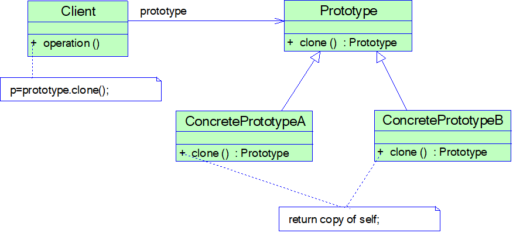

# 原型模式

## 模式概述

定义:
使用原型实例指定待创建对象的类型，并且通过复制这个原型来创建新的对象

工作原理：
将一个原型对象传给要发动创建的对象（即客户端对象），这个要发动创建的对象通过请求原型对象复制自己来实现创建过程

创建新对象（也称为克隆对象）的工厂就是原型类自身，工厂方法由负责复制原型对象的克隆方法来实现

通过克隆方法所创建的对象是全新的对象，它们在内存中拥有新的地址，每一个克隆对象都是独立的

通过不同的方式对克隆对象进行修改以后，可以得到一系列相似但不完全相同的对象

## 模式结构与实现



* Prototype 抽象原型类
* ConcretePrototype 具体原型类
* Client 客户类

抽象原型类
```java
public interface Prototype {
    public Prototype clone();
}
```
具体原型类
```java
public class ConcretePrototype implements Prototype {
    private String attr; 

    public void setAttr(String attr) {
        this.attr = attr;
    }

    public String getAttr() {
        return this.attr;
    }

    //克隆方法
    public Prototype clone() {
        Prototype prototype = new ConcretePrototype(); //创建新对象
        prototype.setAttr(this.attr);
        return prototype;
    }
}
```
客户端类:
```java
……
ConcretePrototype prototype = new ConcretePrototype();
prototype.setAttr("Sunny");
ConcretePrototype copy = (ConcretePrototype)prototype.clone();
……
```

## 模式应用实例


## 模式的优/缺点与适用环境

优点:
* 简化对象的创建过程，通过复制一个已有实例可以提高新实例的创建效率
* 扩展性较好
* 提供了简化的创建结构，原型模式中产品的复制是通过封装在原型类中的克隆方法实现的，无须专门的工厂类来创建产品
* 可以使用深克隆的方式保存对象的状态，以便在需要的时候使用，可辅助实现撤销操作

缺点:
* 需要为每一个类配备一个克隆方法，而且该克隆方法位于一个类的内部，当对已有的类进行改造时，需要修改源代码，违背了开闭原则
* 在实现深克隆时需要编写较为复杂的代码，而且当对象之间存在多重的嵌套引用时，为了实现深克隆，每一层对象对应的类都必须支持深克隆，实现起来可能会比较麻烦


适用环境:
* 创建新对象成本较大，新对象可以通过复制已有对象来获得，如果是相似对象，则可以对其成员变量稍作修改
* 系统要保存对象的状态，而对象的状态变化很小
* 需要避免使用分层次的工厂类来创建分层次的对象
* Ctrl + C  ->  Ctrl + V
