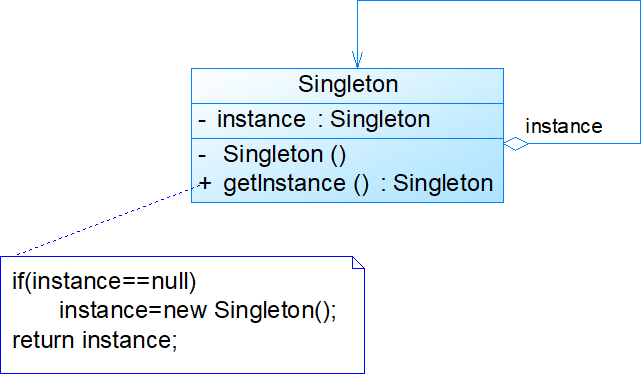

# 单例模式

## 模式概述

定义:
确保一个类只有一个实例，并提供一个全局访问点来访问这个唯一实例

要点：
* 某个类只能有一个实例
* 必须自行创建这个实例
* 必须自行向整个系统提供这个实例

## 模式结构与实现



* 单例角色 Singleton

```java
public class Singleton {
	private static Singleton instance=null;  //静态私有成员变量
     
      //私有构造函数
	private Singleton() {	
	}
	
       //静态公有工厂方法，返回唯一实例
	public static Singleton getInstance() {
		if(instance==null)
		    instance=new Singleton();	
		return instance;
	}
}
```
客户端测试代码:
```java
public class Client{
    public static void main(String arg[]){
        Singleton s1 = Singleton.getInstance();
        Singleton s2 = Singleton.getInstance();
        //判断两个对象是否相同
        if(s1 == s2){
            System.out.println("两个对象是相同实例")
        }
        else{
            System.out.println("两个对象是不同实例")
        }
    }
}
```

## 饿汉式单例与懒汉式单例

### 饿汉式单例

* 无须考虑多个线程同时访问的问题；
* 调用速度和反应时间优于懒汉式单例；
* 资源利用效率不及懒汉式单例；
* 系统加载时间可能会比较长

饿汉式单例类:

```java
public class EagerSingleton { 
    private static final EagerSingleton instance = new EagerSingleton(); 
    private EagerSingleton() { } 
 
    public static EagerSingleton getInstance() {
        return instance; 
    }
}
```

### 懒汉式单例

* 实现了延迟加载；
* 必须处理好多个线程同时访问的问题；
* 需通过双重检查锁定等机制进行控制，将导致系统性能受到一定影响

懒汉式单例:

## 模式应用实例


## 模式的优/缺点与适用环境

优点:
* 提供了对唯一实例的受控访问
* 可以节约系统资源，提高系统的性能
* 允许可变数目的实例(多例类)

缺点:
* 扩展困难(缺少抽象层)
* 单例类的职责过重
* 由于自动垃圾回收机制，可能会导致共享的单例对象的状态丢失

适用环境:
* 系统只需要一个实例对象，或者因为资源消耗太大而只允许创建一个对象
* 客户调用类的单个实例只允许使用一个公共访问点，除了该公共访问点，不能通过其他途径访问该实例
