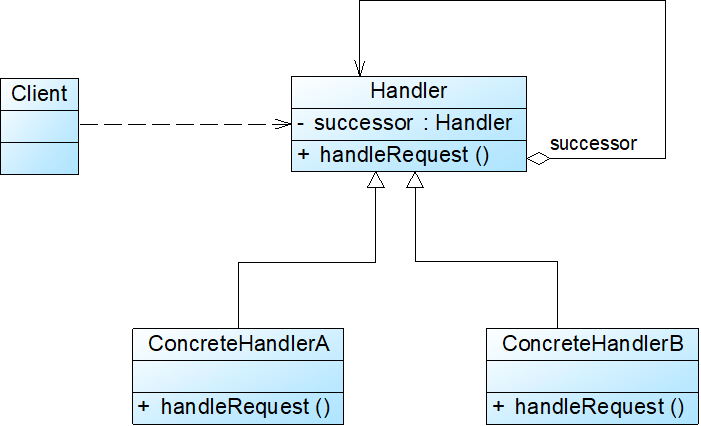

# 职责链模式

## 模式概述

定义: 避免将一个请求的发送者与接收者耦合在一起，让多个对象都有机会处理请求。将接收请求的对象连接成一条链，并且沿着这条链传递请求，直到有一个对象能够处理它为止

* 将请求的处理者组织成一条链，并让请求沿着链传递，由链上的处理者对请求进行相应的处理
* 客户端无须关心请求的处理细节以及请求的传递，只需将请求发送到链上，将请求的发送者和请求的处理者解耦

## 模式结构与实现



两个角色:

* Handler 抽象处理者
* ConcreteHandler 具体处理者

抽象处理者:

```java
public abstract class Handler {
    //维持对下家的引用
    protected Handler successor;
	
    public void setSuccessor(Handler successor) {
        this.successor=successor;
    }
	
    public abstract void handleRequest(String request);
}
```

具体处理者: 

```java
public class ConcreteHandler extends Handler {
    public void handleRequest(String request) {
        if (请求满足条件) {
            //处理请求
        }
        else {
            this.successor.handleRequest(request); //转发请求
        }
    }
}
```

客户端:

```java
……
Handler handler1, handler2, handler3;
handler1 = new ConcreteHandlerA();
handler2 = new ConcreteHandlerB();
handler3 = new ConcreteHandlerC();
//创建职责链
handler1.setSuccessor(handler2);
handler2.setSuccessor(handler3);
//发送请求，请求对象通常为自定义类型
handler1.handleRequest("请求对象");
……
```

## 模式应用实例

## 模式的优/缺点与适用环境

优点

* 使得一个对象无须知道是其他哪一个对象处理其请求，降低了系统的耦合度
* 可简化对象之间的相互连接
* 给对象职责的分配带来更多的灵活性
* 增加一个新的具体请求处理者时无须修改原有系统的代码，只需要在客户端重新建链即可

缺点

* 不能保证请求一定会被处理
* 对于比较长的职责链，系统性能将受到一定影响，在进行代码调试时不太方便
* 如果建链不当，可能会造成循环调用，将导致系统陷入死循环

适用环境

* 有多个对象可以处理同一个请求，具体哪个对象处理该请求待运行时刻再确定
* 在不明确指定接收者的情况下，向多个对象中的一个提交一个请求
* 可动态指定一组对象处理请求