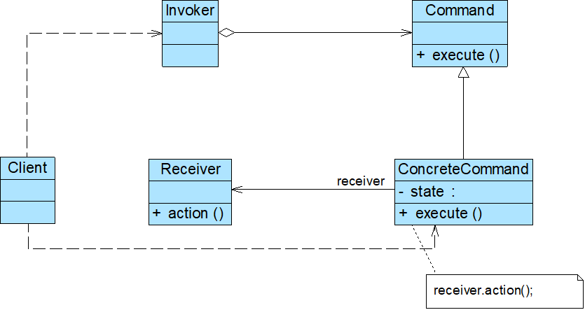

# 命令模式

## 模式概述

定义: 将一个请求封装为一个对象，从而让你可以用不同的请求对客户进行参数化，对请求排队或者记录请求日志，以及支持可撤销的操作

* 别名为动作(Action)模式或事务(Transaction)模式
* “用不同的请求对客户进行参数化”
* “对请求排队”
* “记录请求日志”
* “支持可撤销操作”

## 模式结构与实现



四个角色:

* Command 抽象命令类
* ConcreteCommand 具体命令类
* Invoker 调用者
* Receiver 接收者

抽象命令类:

```java
public abstract class Command {
    public abstract void execute();
}
```

调用者类:

```java
public class Invoker {
    private Command command;

    //构造注入
    public Invoker(Command command) {
        this.command = command;
    }

    //设值注入
    public void setCommand(Command command) {
        this.command = command;
    }

    //业务方法，用于调用命令类的execute()方法
    public void call() {
        command.execute();
    }
}
```

接收者类:

```java
public class Receiver {
    public void action() {
        //具体操作
    }
}
```

具体命令类:

```java
public class ConcreteCommand extends Command {
    private Receiver receiver; //维持一个对请求接收者对象的引用

    public void execute() {
        receiver.action(); //调用请求接收者的业务处理方法action()
    }
}
```

## 模式应用实例

见DesignPattern项目文件-commandPattern包

## 模式的优/缺点与适用环境

优点:

* 降低系统的耦合度
* 新的命令可以很容易地加入到系统中，符合开闭原则
* 可以比较容易地设计一个命令队列或宏命令（组合命令）
* 为请求的撤销(Undo)和恢复(Redo)操作提供了一种设计和实现方案

缺点:

* 使用命令模式可能会导致某些系统有过多的具体命令类（针对每一个对请求接收者的调用操作都需要设计一个具体命令类）

适用环境:

* 系统需要将请求调用者和请求接收者解耦，使得调用者和接收者不直接交互
* 系统需要在不同的时间指定请求、将请求排队和执行请求
* 系统需要支持命令的撤销(Undo)操作和恢复(Redo)操作
* 系统需要将一组操作组合在一起形成宏命令