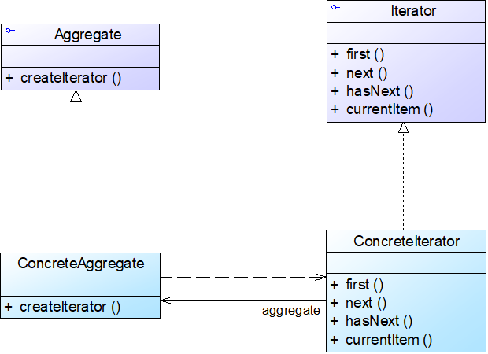

# 迭代器模式

## 模式概述

定义: 提供一种方法顺序访问一个聚合对象中各个元素，且不用暴露该对象的内部表示

* 又名游标(Cursor)模式
* 通过引入迭代器，客户端无须了解聚合对象的内部结构即可实现对聚合对象中成员的遍历，还可以根据需要很方便地增加新的遍历方式

## 模式结构与实现



四个角色:

* Iterator 抽象迭代器
* ConcreteIterator 具体迭代器
* Aggregate 抽象聚合类
* ConcreteAggregate 具体聚合类

抽象迭代器:

```java
public interface Iterator {
    public void first();                    //将游标指向第一个元素
    public void next();                    //将游标指向下一个元素
    public boolean hasNext();        //判断是否存在下一个元素
    public Object currentItem();   //获取游标指向的当前元素
}
```

具体迭代器:

```java
public class ConcreteIterator implements Iterator {
    private ConcreteAggregate objects; //维持一个对具体聚合对象的引用，以便于访问存储在聚合对象中的数据
    private int cursor;  //定义一个游标，用于记录当前访问位置
    public ConcreteIterator(ConcreteAggregate objects) {
        this.objects=objects;
    }

    public void first() {  ......  }
		
    public void next() {  ......  }

    public boolean hasNext() {  ......  }
	
    public Object currentItem() {  ......  }
}
```

抽象聚合类:

```java
public interface Aggregate {
    Iterator createIterator();
}
```

具体聚合类:

```java
public class ConcreteAggregate implements Aggregate {	
    ......	
    public Iterator createIterator() {
        return new ConcreteIterator(this);
    }
    ......
}
```


## 模式应用实例

见DesignPattern项目文件-IteratorPattern包

## 模式的优/缺点与适用环境

优点:

* 支持以不同的方式遍历一个聚合对象，在同一个聚合对象上可以定义多种遍历方式
* 简化了聚合类
* 由于引入了抽象层，增加新的聚合类和迭代器类都很方便，无须修改原有代码，符合开闭原则

缺点:

* 在增加新的聚合类时需要对应地增加新的迭代器类，类的个数成对增加，这在一定程度上增加了系统的复杂性
* 抽象迭代器的设计难度较大，需要充分考虑到系统将来的扩展。在自定义迭代器时，创建一个考虑全面的抽象迭代器并不是一件很容易的事情

适用环境:

* 访问一个聚合对象的内容而无须暴露它的内部表示
* 需要为一个聚合对象提供多种遍历方式
* 为遍历不同的聚合结构提供一个统一的接口，在该接口的实现类中为不同的聚合结构提供不同的遍历方式，而客户端可以一致性地操作该接口