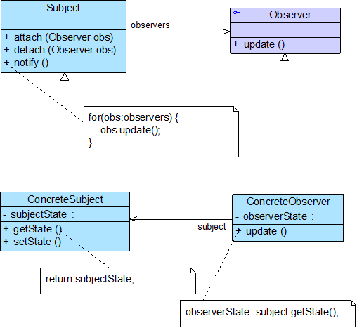

# 观察者模式

## 模式概述

定义: 定义对象之间的一种一对多依赖关系，使得每当一个对象状态发生改变时，其相关依赖对象都得到通知并被自动更新

## 模式结构与实现



四个角色:

* Subject 抽象目标
* ConcreteSubject 具体目标
* Observer 抽象观察者
* ConcreteObserver 具体观察者

抽象目标:

```java
import java.util.*;
public abstract class Subject {
    //定义一个观察者集合用于存储所有观察者对象
    protected ArrayList observers<Observer> = new ArrayList();

    //注册方法，用于向观察者集合中增加一个观察者
    public void attach(Observer observer) {
        observers.add(observer);
    }

    //注销方法，用于在观察者集合中删除一个观察者
    public void detach(Observer observer) {
        observers.remove(observer);
    }

    //声明抽象通知方法
    public abstract void notify();
}
```

具体目标:

```java
public class ConcreteSubject extends Subject {
    //实现通知方法
    public void notify() {
        //遍历观察者集合，调用每一个观察者的响应方法
        for(Object obs:observers) {
            ((Observer)obs).update();
        }
    }	
}
```

抽象观察者:

```java
public interface Observer {
    //声明响应方法
    public void update();
}
```

具体观察者:

```java
public class ConcreteObserver implements Observer {
    //实现响应方法
    public void update() {
        //具体响应代码
    }
}
```


## 模式应用实例

## 模式的优/缺点与适用环境

优点:

* 可以实现表示层和数据逻辑层的分离
* 在观察目标和观察者之间建立一个抽象的耦合
* 支持广播通信，简化了一对多系统设计的难度
* 符合开闭原则，增加新的具体观察者无须修改原有系统代码，在具体观察者与观察目标之间不存在关联关系的情况下，增加新的观察目标也很方便

缺点:

* 将所有的观察者都通知到会花费很多时间
* 如果存在循环依赖时可能导致系统崩溃
* 没有相应的机制让观察者知道所观察的目标对象是怎么发生变化的，而只是知道观察目标发生了变化

适用场景:

* 一个抽象模型有两个方面，其中一个方面依赖于另一个方面，将这两个方面封装在独立的对象中使它们可以各自独立地改变和复用
* 一个对象的改变将导致一个或多个其他对象发生改变，且并不知道具体有多少对象将发生改变，也不知道这些对象是谁
* 需要在系统中创建一个触发链