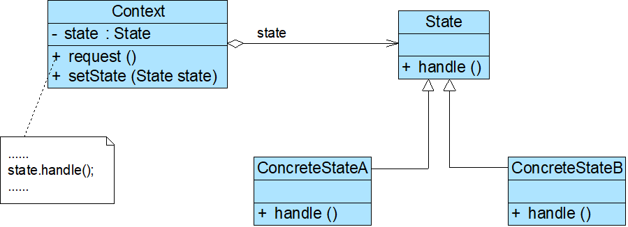

# 状态模式

## 模式概述

定义:允许一个对象在其内部状态改变时改变它的行为。对象看起来似乎修改了它的类

* 又名状态对象(Objects for States)
* 用于解决系统中复杂对象的状态转换以及不同状态下行为的封装问题
* 将一个对象的状态从该对象中分离出来，封装到专门的状态类中，使得对象状态可以灵活变化
* 对于客户端而言，无须关心对象状态的转换以及对象所处的当前状态，无论对于何种状态的对象，客户端都可以一致处理

## 模式结构与实现



三个角色:

* Context 环境类
* State 抽象状态类
* ConcreteState 具体状态类

抽象状态类:

```java
public abstract class State {
    //声明抽象业务方法，不同的具体状态类可以有不同的实现
    public abstract void handle();
}
```

具体状态类:

```java
public class ConcreteState extends State {
    public void handle() {
        //方法具体实现代码
    }
}
```

环境类:

```java
public class Context {
    private State state; //维持一个对抽象状态对象的引用
    private int value;  //其他属性值，该属性值的变化可能会导致对象的状态发生变化

    public void setState(State state) {
        this.state = state;
    }

    public void request() {
        //其他代码
        state.handle(); //调用状态对象的业务方法
        //其他代码
    }
}
```

状态转换:

```java
    ……
public void changeState()
{
          //判断属性值，根据属性值进行状态转换
	if (value == 0)
	{
		this.setState(new ConcreteStateA());
	}
	else if (value == 1)
	{
		this.setState(new ConcreteStateB());
	}
	......
}
    ……
```

```java
    ……
    public void changeState(Context ctx) {
        //根据环境对象中的属性值进行状态转换
        if (ctx.getValue() == 1) {
            ctx.setState(new ConcreteStateB());
        }
        else if (ctx.getValue() == 2) {
            ctx.setState(new ConcreteStateC());
        }
        ......
    }
    ……
```


## 模式应用实例

## 模式的优/缺点与适用环境

优点:

* 封装了状态的转换规则，可以对状态转换代码进行集中管理，而不是分散在一个个业务方法中
* 将所有与某个状态有关的行为放到一个类中，只需要注入一个不同的状态对象即可使环境对象拥有不同的行为
* 允许状态转换逻辑与状态对象合成一体，而不是提供一个巨大的条件语句块，可以避免使用庞大的条件语句来将业务方法和状态转换代码交织在一起
* 可以让多个环境对象共享一个状态对象，从而减少系统中对象的个数

缺点:

* 会增加系统中类和对象的个数，导致系统运行开销增大
* 结构与实现都较为复杂，如果使用不当将导致程序结构和代码混乱，增加系统设计的难度
* 对开闭原则的支持并不太好，增加新的状态类需要修改负责状态转换的源代码，否则无法转换到新增状态；而且修改某个状态类的行为也需要修改对应类的源代码

适用环境:

* 对象的行为依赖于它的状态（例如某些属性值），状态的改变将导致行为的变化
* 在代码中包含大量与对象状态有关的条件语句，这些条件语句的出现会导致代码的可维护性和灵活性变差，不能方便地增加和删除状态，并且导致客户类与类库之间的耦合增强