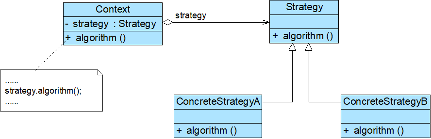

# 策略模式

## 模式概述

定义: 定义一系列算法，将每一个算法封装起来，并让它们可以相互替换。策略模式让算法可以独立于使用它的客户变化。

* 又称为政策(Policy)模式
* 每一个封装算法的类称之为策略(Strategy)类
* 策略模式提供了一种可插入式(Pluggable)算法的实现方案

## 模式结构与实现



三个角色:

* Context 环境类
* Strategy 抽象策略类: 可以是抽象类或具体类,也可以时接口
* ConcreteStrategy 具体策略类

抽象策略类:

```java
public abstract class Strategy {
    public abstract void algorithm();  //声明抽象算法
}
```

具体策略类:

```java
public class ConcreteStrategyA extends Strategy {
    //算法的具体实现
    public void algorithm() {
        //算法A
    }
}
```

环境类:

```java
public class Context {
    private Strategy strategy; //维持一个对抽象策略类的引用

    //注入策略对象
    public void setStrategy(Strategy strategy) {
        this.strategy= strategy;
    }

    //调用策略类中的算法
    public void algorithm() {
        strategy.algorithm();
    }
}
```

客户端测试:

```java
……
Context context = new Context();
Strategy strategy;
strategy = new ConcreteStrategyA(); //可在运行时指定类型，通过配置文件和反射机制实现
context.setStrategy(strategy);
context.algorithm();
……
```


## 模式应用实例

见DesignPattern项目文件-strategyPattern包

## 模式的优/缺点与适用环境

优点:

* 提供了对开闭原则的完美支持，用户可以在不修改原有系统的基础上选择算法或行为，也可以灵活地增加新的算法或行为
* 提供了管理相关的算法族的办法
* 提供了一种可以替换继承关系的办法
* 可以避免多重条件选择语句
* 提供了一种算法的复用机制，不同的环境类可以方便地复用策略类

缺点:

* 客户端必须知道所有的策略类，并自行决定使用哪一个策略类
* 将造成系统产生很多具体策略类
* 无法同时在客户端使用多个策略类

适用环境:

* 一个系统需要动态地在几种算法中选择一种
* 避免使用难以维护的多重条件选择语句
* 不希望客户端知道复杂的、与算法相关的数据结构，提高算法的保密性与安全性