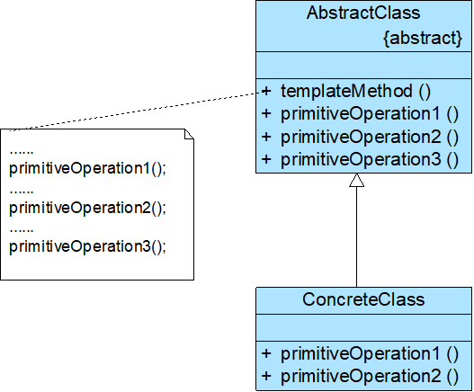

# 模板方法模式

## 模式概述

定义: 定义一个操作中算法的框架，而将一些步骤延迟到子类中。模板方法模式使得子类不改变一个算法的结构即可重定义该算法的某些特定步骤

* 是一种基于继承的代码复用技术
* 将一些复杂流程的实现步骤封装在一系列基本方法中
* 在抽象父类中提供一个称之为模板方法的方法来定义这些基本方法的执行次序，而通过其子类来覆盖某些步骤，从而使得相同的算法
* 框架可以有不同的执行结果

## 模式结构与实现



两个角色:

* AbstractClass 抽象类
* ConcreteClass 具体子类

模板方法:

```java
……
//模板方法
public void template() {
    open();
    display();
    //通过钩子方法来确定某一步骤是否执行
    if(isPrint()) {
        print();
    }
}
 
//钩子方法
public boolean isPrint() {
    return true;
}
……
```

抽象类:

```java
public abstract class AbstractClass {
    //模板方法
    public void templateMethod() {
        primitiveOperation1();
        primitiveOperation2();
        primitiveOperation3();
}

    //基本方法—具体方法
    public void primitiveOperation1() {
        //实现代码
    }

    //基本方法—抽象方法
    public abstract void primitiveOperation2();    

    //基本方法—钩子方法
    public void primitiveOperation3()   
    {  }
}
```

具体子类:

```java
public class ConcreteClass extends AbstractClass {
    public void primitiveOperation2() {
        //实现代码
    }

    public void primitiveOperation3() {
        //实现代码
    }
}
```


## 模式应用实例

## 模式的优/缺点与适用环境

优点:

* 在父类中形式化地定义一个算法，而由它的子类来实现细节的处理，在子类实现详细的处理算法时并不会改变算法中步骤的执行次序
* 提取了类库中的公共行为，将公共行为放在父类中，而通过其子类来实现不同的行为
* 可实现一种反向控制结构，通过子类覆盖父类的钩子方法来决定某一特定步骤是否需要执行
* 更换和增加新的子类很方便，符合单一职责原则和开闭原则

缺点:

* 需要为每一个基本方法的不同实现提供一个子类，如果父类中可变的基本方法太多，将会导致类的个数增加，系统会更加庞大，设计也更加抽象（可结合桥接模式）

使用环境:

* 一次性实现一个算法的不变部分，并将可变的行为留给子类来实现
* 各子类中公共的行为应被提取出来，并集中到一个公共父类中，以避免代码重复
* 需要通过子类来决定父类算法中某个步骤是否执行，实现子类对父类的反向控制